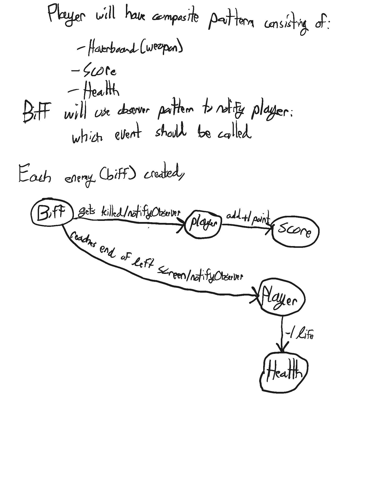

# Team Project (fa22-202 Three Musketeers and Journal)
------------------
## Table of Contents
- [Team Project (fa22-202 Three Musketeers and Journal)](#team-project-fa22-202-three-musketeers-and-journal)
  - [Table of Contents](#table-of-contents)
  - [Topic](#topic)
  - [Videos](#videos)
  - [Team Members](#team-members)
  - [Project Summary](#project-summary)
    - [Goal](#goal)
  - [High Level Architecture Diagram](#high-level-architecture-diagram)
  - [Key Feature Summary](#key-feature-summary)
  - [Design Patterns](#design-patterns)
    - [Composite](#composite)
    - [Observer](#observer)
  - [Resources](#resources)

## Topic
TODO

---
## Videos
TODO

---
## Team Members
| Name          | Student ID    |  XP Core Value  | Journals  |
| ------------- |---------------| --------------- | --------------- |
| [Waqas Kureshy](https://github.com/kureshy)  | 015421575     |  Communication       | [Weekly Journal](Journals/Waqas%20Kureshy's%20Project%20Journal.md) |
| [Vidas Sileikis](https://github.com/vs256)      | 016315897     |  Feedback       | [Weekly Journal](Journals/Vidas%20Sileikis's%20Project%20Journal.md) |

---
## Project Summary

This project is a video game where you play as a space shooter destroyings enemy biff's that are coming at you. Get your space ship ready because the enemies are coming and it is up to you to save the world with your mighty space ship that shoots out hoverboards!

### Goal
The goal is to create a well-designed video game that implements design patterns & encourages team collaboration through a Scrum setting.

---
## High Level Architecture Diagram
TODO

---
## Key Feature Summary

Key Features:
- Screens:
  - Home
  - Gameplay
  - Game Over

- Player (Spaceship)
  - Can shoot hoverboards to attack flying enemies
  - The observer design pattern is implemented for the following functionalities:
    - Health
    - Score
- Enemies
  - Generator that continually spawns enemies to attack the player.
  - Factory method design pattern is implemented here.

---

## Design Patterns

Observer & Composite pattern discussion

### Composite
- Player will be a composite of different classes
  - Health
  - Hoverboard (weapon)
  - Score
  

### Observer
- Each Biff enemy will notify the player observer which will act accordingly:
  - If biff gets killed, +1 point is added to score.
  - If biff gets over to the end of the left screen without getting killed, a life is taken away from the player.

---

## Resources
[Project Task Board](https://github.com/orgs/nguyensjsu/projects/14)

[Sprint Task Sheet](https://docs.google.com/spreadsheets/d/1_7OaH0Ns1McdoYEcVgvOgk_x9eFzFv0BA5ryzZEm2_c/edit?usp=sharing)
